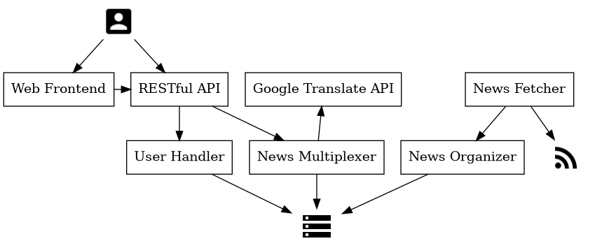

# Echelonews

EcheloNews is a news multiplexer; basically, it fetches news from all over the
world, classifying them by topic and giving them back to users according to
their preferences.

## Architecture

EcheloNews is (i.e. will be) designed as a set of loosely coupled modules,
which can be easily turned into microservices. The architecture is (i.e. will
be hopefully) described in the following image:

  

### Modules

#### RESTful API
The main EcheloNews interface, built on top of standard HTTP verbs with the
REST paradigm and delivered as SaaS

#### Web Frontend
A website frontend, built on top of the RESTful API

#### News fetcher
Fetch news via the RSS protocol from various websites (with long-time
polling), and pass them to the news organizer as a JSON object

#### News organizer
Organize news and save them in a permanent data structure (e.g. SQL database)

#### News multiplexer
Multiplex news according to topic or category and return them to a user
interface microservice (on-demand).
**NOTE**: It calls the Google Translate API to translate news feeds'
description and title

#### Logger
Keep track of logs, storing them in an isolated database

## License

MIT License

Copyright (c) 2020 Nicola Colao
Copyright (c) 2020 Paolo Lucchesi
Copyright (c) 2020 Dejan Nuzzi

Permission is hereby granted, free of charge, to any person obtaining a copy
of this software and associated documentation files (the "Software"), to deal
in the Software without restriction, including without limitation the rights
to use, copy, modify, merge, publish, distribute, sublicense, and/or sell
copies of the Software, and to permit persons to whom the Software is
furnished to do so, subject to the following conditions:

The above copyright notice and this permission notice shall be included in all
copies or substantial portions of the Software.

THE SOFTWARE IS PROVIDED "AS IS", WITHOUT WARRANTY OF ANY KIND, EXPRESS OR
IMPLIED, INCLUDING BUT NOT LIMITED TO THE WARRANTIES OF MERCHANTABILITY,
FITNESS FOR A PARTICULAR PURPOSE AND NONINFRINGEMENT. IN NO EVENT SHALL THE
AUTHORS OR COPYRIGHT HOLDERS BE LIABLE FOR ANY CLAIM, DAMAGES OR OTHER
LIABILITY, WHETHER IN AN ACTION OF CONTRACT, TORT OR OTHERWISE, ARISING FROM,
OUT OF OR IN CONNECTION WITH THE SOFTWARE OR THE USE OR OTHER DEALINGS IN THE
SOFTWARE.
